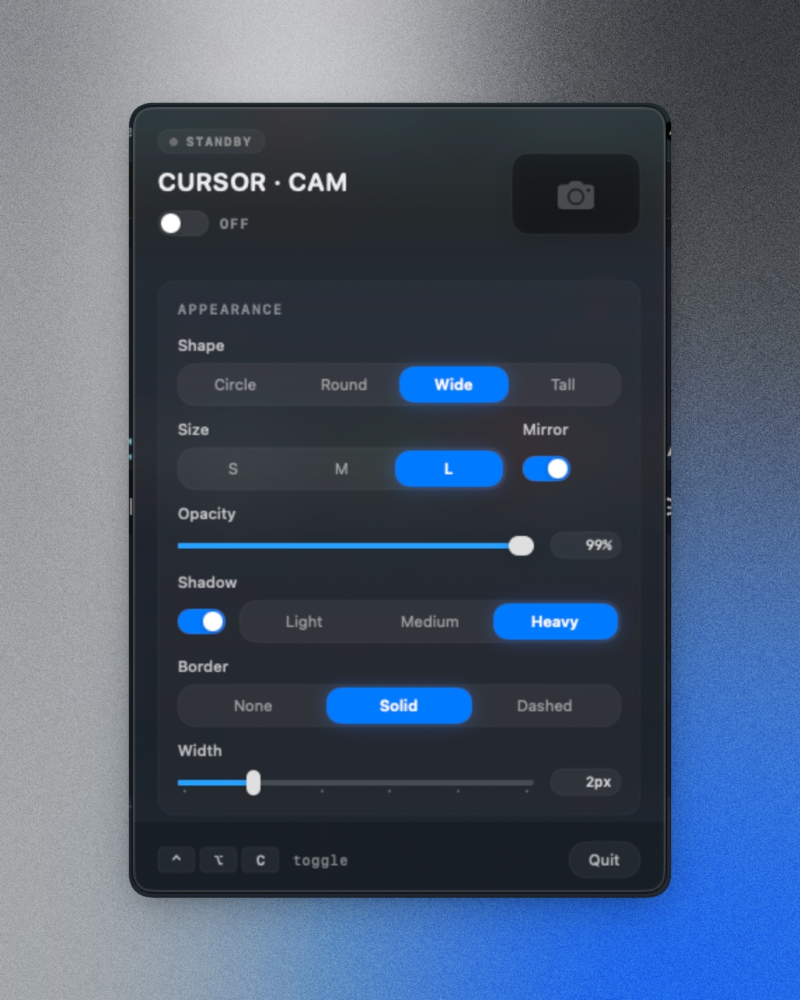

# Cursor-Cam

<video src="assets/Tutorial.mp4" autoplay loop muted playsinline width="100%"></video>

A tiny floating camera overlay for macOS that follows your cursor. Any screen recorder captures it natively — no plugins, no virtual cameras, no setup.

Record with Loom, OBS, Screen Studio, QuickTime, or anything else. The cam is just a borderless window that sits above all your apps and follows your mouse.

## Why

Presenters have three bad options: recorder-specific cam bubbles locked to one tool, manual repositioning, or no cam at all. Cursor-Cam puts your face where your viewer's eyes already track: right next to the cursor.

## How it works

- Press **Control + Option + C** to toggle the cam on/off
- The cam follows your cursor with spring animation at 60fps
- Choose where it sits relative to the cursor: center, bottom-right, bottom-left, top-left, top-right
- Pin it to a screen corner, or free-drag it anywhere
- Pick from four shapes: circle, rounded square, vertical pill, horizontal pill
- Three sizes: small (80px), medium (120px), large (180px)
- Mirror toggle (on by default, like FaceTime)
- Optional audio-reactive glow that pulses with your voice
- Customizable border: none, solid, or dashed at 5 different widths

Everything persists across launches. Click the camera icon in your menu bar to access all settings.



## Requirements

- macOS 15 or later
- Camera access (built-in, external, or iPhone Continuity Camera)
- Microphone access (only if you enable the audio glow feature)
- Accessibility access (for the global hotkey; the menu bar toggle works without it)

Cursor-Cam never records anything. It's just a window — your screen recorder does the recording.

## Installing

Download the latest DMG from [Releases](https://github.com/lahfir/cursor-cam/releases). Drag to Applications. On first launch, grant Camera and Accessibility permissions when prompted.

## Building from source

```bash
git clone https://github.com/lahfir/cursor-cam.git
cd cursor-cam/cursor-cam
open cursor-cam.xcodeproj
```

Build with Xcode 16+ (macOS 15 SDK). Target: `cursor-cam`. The app is not sandboxed (CGEvent tap requires it) and uses hardened runtime for notarization.

## Project structure

```
cursor-cam/
├── App/
│   ├── CursorCamApp.swift           # @main entry point
│   └── CursorCamAppDelegate.swift    # Lifecycle, manager wiring
├── Models/
│   ├── Enums.swift                   # All enums (shape, size, mode, etc.)
│   └── SettingsStore.swift           # UserDefaults persistence
├── Services/
│   ├── CameraManager.swift           # AVCaptureSession, device discovery
│   ├── HotkeyMonitor.swift           # CGEvent tap for ⌃⌥C
│   └── PermissionsManager.swift      # Camera + Accessibility flows
├── Overlay/
│   ├── OverlayWindow.swift           # NSWindow subclass per display
│   └── OverlayWindowManager.swift    # Per-screen lifecycle, positioning
├── MenuBar/
│   └── MenuBarManager.swift          # NSStatusItem + dropdown menu
├── Views/
│   └── CameraPreviewView.swift       # SwiftUI view: preview, shapes, borders
├── Resources/
│   ├── Assets.xcassets/              # App icon
│   └── CursorCam.entitlements        # Non-sandboxed, camera access
└── cursor-camTests/
    ├── Models/SettingsStoreTests.swift
    ├── Overlay/OverlayWindowManagerTests.swift
    ├── Overlay/PositioningModeTests.swift
    └── Services/CameraManagerTests.swift
```

## Architecture

Singleton-free. All managers are `@MainActor ObservableObject` classes owned by the AppDelegate. State flows through `@Published` properties and Combine pipelines — no delegates, no NotificationCenter for internal communication.

The overlay system creates one `NSWindow` (`.screenSaver` level, `.borderless` style, `.canJoinAllSpaces` collection behavior) per connected display. Only the cursor-containing display renders the cam; others stay at zero opacity to keep the preview layer warm. Cross-monitor handoff is sequential fade with 150ms debounce.

## License

MIT
