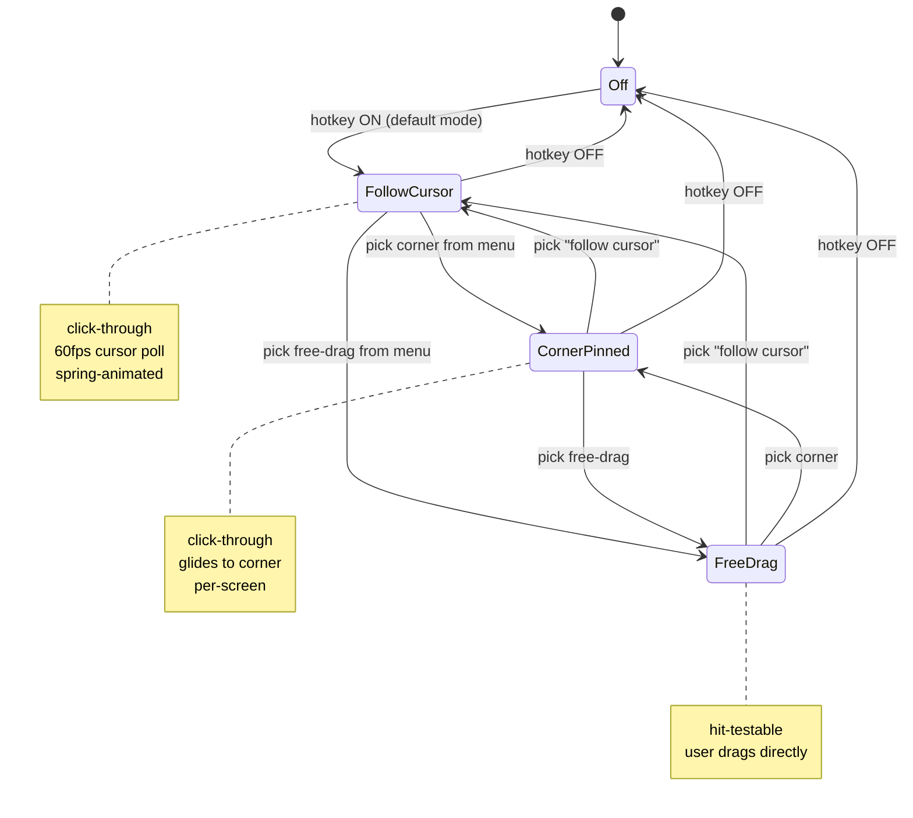

# Cursor-Cam — Floating Camera That Follows Your Cursor

## Problem Frame

People recording themselves on screen — async (Loom, Screen Studio, Recordly, OBS) and live (Twitch, YouTube) — pick between three bad options:

1. **Built-in recorder cam** (Loom bubble, OBS source) — locked to one recorder, fixed corner, no cursor-anchoring, can't be reused across recorders.
2. **Manual repositioning** — drag the cam each time it covers the wrong region.
3. **No cam** — viewer loses the presenter's face entirely.

A floating cam window that lives outside any recorder, defaults to following the cursor, and toggles on/off with one shortcut would solve all three. The pattern is unbuilt commercially: the founder saw it custom-coded inside Clicky's onboarding (an `AVPlayer` pinned to the cursor) and confirmed no shipping product offers it. The bet: cursor-anchoring is a meaningful behavioral wedge over corner-pinned cams because the viewer's eyes already track the cursor — putting the face there matches gaze.

**Primary actors:** macOS-native creators recording async videos *and* streamers going live. v1 ships one product that satisfies both via shared minimal defaults, not two SKUs.

---

## Actors

- A1. **Presenter** — the human running the recording or stream. Toggles the cam, picks the camera, drags it, hits the hotkey.
- A2. **Recording / streaming software** — Loom, Screen Studio, Recordly, OBS, QuickTime, Twitch Studio, YouTube Studio. Sees cursor-cam as a regular composited window and captures it the same way it captures any other window. Cursor-cam is invisible-as-a-source: there is no NDI, no virtual cam, no setup inside the recorder.
- A3. **Recording viewer** — eventually-watches the produced video. Doesn't interact with cursor-cam directly; the product's value to this actor is *"presenter's face is where I'm already looking."*

---

## Key Flows

- F1. **First-launch & permissions**
  - **Trigger:** Presenter opens the app for the first time
  - **Actors:** A1
  - **Steps:** App launches → menu bar icon appears → cam OFF by default → presenter clicks the menu bar icon → permissions sheet asks for Camera and Accessibility (for global hotkey) → on grant, app is ready
  - **Outcome:** App is permission-ready and has a default camera selected
  - **Covered by:** R1, R3, R10, R15

- F2. **Toggle on, record, toggle off**
  - **Trigger:** Presenter starts a recording in their tool of choice and presses the global hotkey
  - **Actors:** A1, A2
  - **Steps:** Presses the hotkey → cam fades in next to cursor → cam follows cursor across the screen → presses the hotkey again at end of recording → cam fades out
  - **Outcome:** Recording captures the cursor-cam wherever it appeared on screen
  - **Covered by:** R3, R4, R5, R7

- F3. **Switch positioning mode mid-session**
  - **Trigger:** Presenter wants to demo a stationary UI without the cam moving
  - **Actors:** A1
  - **Steps:** Click menu bar icon → pick *"Pin to bottom-right corner"* → cam glides to bottom-right of current screen → stays there → presenter switches back to *"Follow cursor"* before next demo
  - **Outcome:** Cam mode changed without re-toggling cam off/on
  - **Covered by:** R5, R6

- F4. **Multi-monitor crossover**
  - **Trigger:** Presenter moves cursor across monitors mid-recording
  - **Actors:** A1, A2
  - **Steps:** Cursor enters second display → cursor-cam window on the original display fades out → cursor-cam appears on the new display at the cursor → recording on each display captures the cam only when present
  - **Outcome:** Exactly one cursor-cam visible at a time, on the active display
  - **Covered by:** R8

---

## Mode State Diagram

---

## Requirements

**Core overlay**
- R1. Camera preview renders in a borderless transparent window (`NSPanel` / `NSWindow`, level above all apps, joins all Spaces, non-activating, never steals focus).
- R2. Window is captured by any standard macOS screen-recording software (ScreenCaptureKit, Loom, Screen Studio, Recordly, OBS, QuickTime). The product depends on this — verify with at least Loom + Screen Studio + OBS during planning.
- R3. Window toggles on/off with a single global hotkey. v1 ships one hardcoded chord; configuring is v2.
- R4. Toggle fades in over ~250ms and fades out over ~400ms. No abrupt pop.

**Positioning modes**
- R5. Three modes, switched from menu bar dropdown: **Follow cursor** (default), **Pin to corner** (TL / TR / BL / BR pickable), **Free drag** (presenter drags cam to any spot, stays there).
- R6. Mode change does not toggle the cam off; cam glides to its new resting state with the same spring used for cursor-follow.
- R7. In Follow-cursor mode: 60fps cursor polling, spring-animated offset (`response: 0.2`, `dampingFraction: 0.6`), cam sits ~10–20px down-right of the cursor (mirror Clicky's `OverlayWindow` math). Click-through always.
- R8. Multi-monitor: one overlay window per `NSScreen`. Only the screen containing the cursor renders the cam (`screenFrame.contains(NSEvent.mouseLocation)` gate). Cross-monitor handoff fades out/in without flicker; only one cam visible at a time globally.
- R9. In Free-drag mode: cam window is hit-testable so the user can drag it directly. In Follow-cursor and Pin-to-corner modes: window is `ignoresMouseEvents = true`.

**Camera & appearance (intentionally minimal)**
- R10. Camera picker in menu bar dropdown enumerates all `AVCaptureDevice` video inputs (built-in, USB, iPhone Continuity Camera). Selection persists across launches.
- R11. Two shape options: **circle** (default) and **rounded square**. No raw rectangle — looks unfinished against modern UIs.
- R12. Three size presets: **S**, **M** (default), **L**. Pixel sizes set during planning. No freeform resize in v1.
- R13. Mirror toggle (default ON, matching FaceTime / Photo Booth selfie convention).

**Lifecycle & persistence**
- R14. Settings persist across launches via `UserDefaults` / `@AppStorage`: selected camera, mode, corner, shape, size, mirror state, last free-drag position.
- R15. App is menu-bar-only (`LSUIElement = true`), no dock icon, no main window. Menu bar icon shows ON/OFF state.
- R16. `AVCaptureSession` starts on first toggle-on, stays running across toggle-off (so re-toggle is instant). Session stops only when the user quits the app or the camera disconnects.
- R17. Quitting from the menu bar fully releases camera and accessibility access.

---

## Acceptance Examples

- AE1. **Covers R7, R8.** Given the cam is ON in Follow-cursor mode and the cursor sits at `(800, 400)` on Display 1, when the user moves the cursor to `(200, 300)` on Display 2, the cam fades out on Display 1 and fades in on Display 2 next to the cursor within ~120ms; no two cams ever appear simultaneously.
- AE2. **Covers R2.** Given the cam is ON, when the user records the entire screen with Loom or OBS, the resulting video file shows the cursor-cam at the same on-screen positions and sizes a viewer would have seen live — no missing frames, no black box, no recorder-specific masking.
- AE3. **Covers R5, R6.** Given the cam is ON in Follow-cursor mode, when the user switches to *"Pin top-right"* from the menu bar, the cam glides from its current cursor-anchored position to the top-right corner of the current display in ~400ms with no flicker and no off/on cycle.
- AE4. **Covers R9.** Given the cam is in Free-drag mode and visible at `(400, 400)`, when the user click-and-drags the cam to `(100, 700)`, the cam moves with the cursor during drag and stays at `(100, 700)` on release; clicks on whatever was under the cam *before* the drag are not received by the underlying app while the drag is in progress.
- AE5. **Covers R3, R16.** Given the cam was toggled ON then OFF five seconds ago, when the user presses the global hotkey again, the cam reappears within ~80ms (camera session is already warm, no re-permission, no shape re-render flash).

---

## Success Criteria

**Human outcome**
- Presenter can record a Loom / OBS / Screen Studio / Recordly session with face-cam visible without ever touching the recorder's webcam settings.
- A first-time user can go from launch to *"cam is on the screen, following my cursor"* in under 90 seconds, including granting Camera + Accessibility permissions.
- Across a 10-minute recording, the presenter never feels they need to reposition the cam mid-take.

**Downstream-agent handoff**
- The `/ce-plan` handoff has enough product detail that planning can produce a build plan without re-asking what modes exist, what shapes ship in v1, or what the hotkey defaults to.
- Every requirement has either an observable behavior or a stated structural reason.
- The Clicky overlay reference pattern is concretely identifiable (file paths) so planning does not redesign cursor-tracking from scratch.

---

## Scope Boundaries

### Deferred for later (v1.5 / v2)

- Configurable global hotkey.
- Freeform drag-to-resize handle.
- AI background blur / removal.
- Opacity slider, custom borders, drop shadows beyond a single tasteful default.
- Saved presets (*"Streaming"* / *"Loom"* / *"Demo"*) with one-click apply.
- Per-app behavior rules (auto-pin when Keynote is frontmost, etc.).
- Recording-detection / auto-show when a recorder starts.
- Microphone passthrough or audio mixing.
- Click-through toggle in Pin / Follow modes (Free-drag is the only interactive mode in v1).
- Smart-park zones (auto-pin in fullscreen video apps).
- Multi-camera composite (PIP of two cameras).
- Effects: zoom, scene switching, lower-thirds.
- Cross-platform (Windows, Linux). v1 is macOS-only.

### Outside this product's identity

- **Becoming a recorder.** Cursor-cam never records. Recording is the user's existing tool's job. The product deliberately depends on being captured, not on capturing.
- **Becoming a virtual webcam / NDI source.** That path leads into the OBS-plugin / Snap-Camera category and competes with established tools. The wedge is *"no setup in your recorder"* — adding a virtual-cam driver kills the wedge.
- **Becoming a beauty filter / AR effects app.** Any face-tracking, makeup, or AR overlay turns this into Snap Camera and abandons the *"minimal floating cam"* identity.
- **Becoming a teleprompter / scripting tool.** Adjacent product (text overlay near cursor) — tempting because the overlay infra is identical, but it splits the pitch.

---

## Key Decisions

- **Cursor-following is the differentiating wedge.** Multi-mode is required because real recordings need stationary cam moments, but the menu bar icon, marketing, and default mode all lean into cursor-following. The other modes exist to keep the cam useful, not to dilute the pitch.
- **Truly-minimal v1.** Three modes, two shapes, three sizes, one hotkey, mirror toggle, camera picker. Anything else (background removal, opacity, freeform resize, presets) is v1.5+. Carrying cost of *"minimal"* must be defended every release.
- **Recording-agnostic by being a regular window.** No virtual cam driver, no plugin, no recorder integration. Cursor-cam is a borderless `NSWindow` that any screen capture sees natively — same architectural choice Clicky uses for its overlay.
- **Reuse Clicky's overlay pattern.** Per-screen `NSWindow`s with `level=.screenSaver`, `collectionBehavior=[.canJoinAllSpaces, .stationary, .fullScreenAuxiliary]`, `canBecomeKey=false`. 60fps cursor tracking via `Timer` polling `NSEvent.mouseLocation`. Spring-animated positioning. `AVPlayerLayer` → `AVCaptureVideoPreviewLayer` is a one-for-one swap. Reference files (in the `clicky` repo): `leanring-buddy/OverlayWindow.swift` (per-screen overlay, cursor tracking, spring animation, multi-monitor gate) and `leanring-buddy/CompanionResponseOverlay.swift` (cursor-anchored panel positioning, edge-clamping, fade-out lifecycle).
- **Direct distribution, not Mac App Store.** Global hotkey via CGEvent tap requires the app to be non-sandboxed; MAS won't accept it. Notarized DMG + Sparkle for updates.
- **macOS-only v1.** Cursor-anchored floating cam works as well on Windows / Linux conceptually, but the entire windowing + permission architecture differs. Cross-platform is v2 (likely a rewrite, not a port).

---

## Dependencies / Assumptions

- **macOS 13+ assumption (verify in planning).** ScreenCaptureKit and modern AVCapture APIs available; iPhone Continuity Camera works without extra plumbing.
- **Camera permission and Accessibility permission must both be granted.** Camera for `AVCaptureSession`; Accessibility for the listen-only `CGEvent` tap that powers the global hotkey. Without Accessibility, the hotkey silently fails — a known sharp edge to design the onboarding around.
- **Bet — cursor-following is a meaningful wedge, not a gimmick.** No commercial product ships this. Risk: viewers / presenters find it distracting or motion-sickness-inducing. Mitigation: lazy-spring damping (Clicky's tuning is a known-good baseline), and the multi-mode design lets users opt out without abandoning the product.
- **Bet — no commercial product ships this because it's an unmade opportunity, not because it's been tried and failed.** Falsifiable by a competitor shipping in the next ~6 months; in that case, the minimal positioning is still defensible.
- **Performance budget assumption.** One `AVCaptureSession` at 720p / 30fps + 60fps window-position polling consumes ~3–5 W on Apple Silicon. Verify in planning with Activity Monitor; iterate spring-tuning + polling cadence if budget is exceeded.

---

## Outstanding Questions

### Resolve Before Planning

- *(none — all blocking product decisions resolved.)*

### Deferred to Planning

- [Affects R3][Technical] What hotkey chord should v1 ship as the default, given that `⌘⇧C` collides with Chrome / Firefox bookmarks-sidebar and similar common app shortcuts? Candidates: `⌃⌥⇧C`, `⌃⌥V`, `fn + C`. Pick during planning by surveying common app conflict tables.
- [Affects R12][Needs research] Exact pixel sizes for S / M / L. Reasonable starting point: 80 / 120 / 180 px diameter for circle. Validate during planning by capturing test recordings at common viewport sizes (1080p, 1440p, 4K) and checking cam-area-vs-screen ratio.
- [Affects R10][Technical] iPhone Continuity Camera handling — does it appear in `AVCaptureDevice.DiscoverySession` automatically, and how to handle hot-plug (iPhone wakes / sleeps mid-session)?
- [Affects R8][Technical] Cross-monitor fade timing — is per-screen window fade-out / fade-in the right model, or should one window span the full virtual desktop and reposition? Clicky uses per-screen and it works; verify under non-uniform DPI / Retina + non-Retina mixed setups.
- [Affects R2][Needs research] Do any modern screen recorders (notably Loom on macOS 14+, Screen Studio, Recordly) exclude `LSUIElement` or `level=.screenSaver` windows from default capture? Test before committing to the architecture.
- [Affects R7][Needs research] Does the cam window's own composition affect cursor responsiveness or input latency in nearby apps? Worth a quick test in planning.
- [Affects R9][Technical] Free-drag mode interaction model — is the entire cam grabbable, or only a small handle on hover? Tradeoff: full-grab is simpler, handle is less likely to absorb mis-clicks.
- [Affects R11][Technical] Square aspect-ratio handling for non-1:1 cameras — center-crop vs. letterbox. Center-crop is the obvious default but worth confirming in planning.

---

## Next Steps

`-> /ce-plan` for structured implementation planning.
